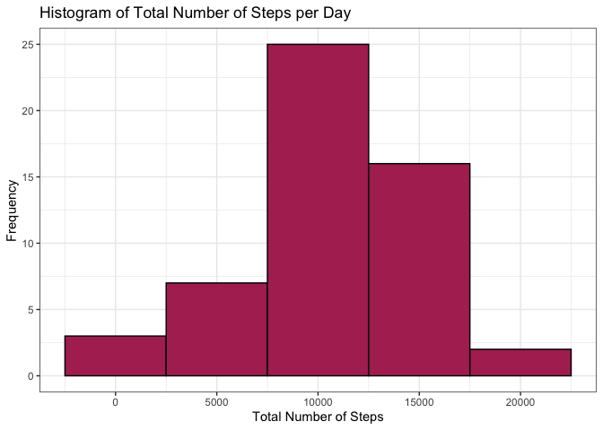
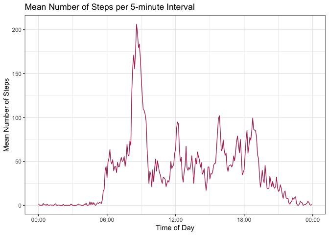
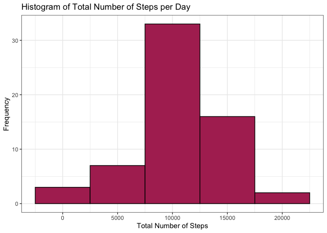
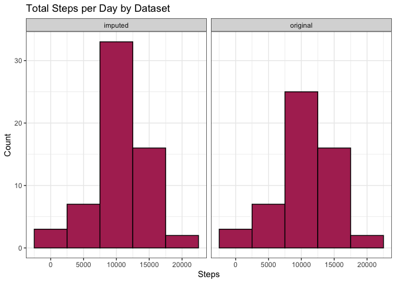
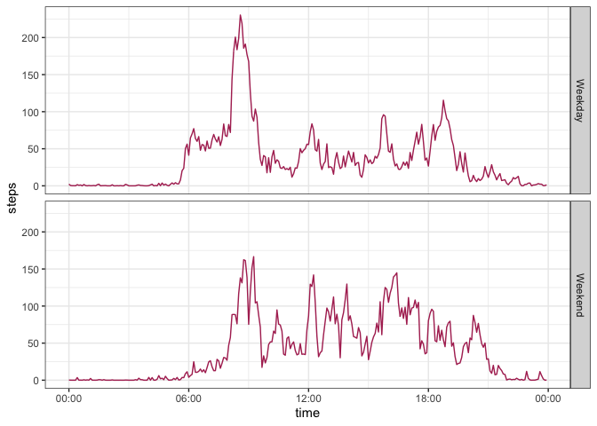

## Loading and preprocessing the data

First, the repository was forked from GitHub and downloaded to the researcher's computer. The activity dataset was then loaded into R. Before analysis, the 'Date' variable was coerced to POSIXct format, to allow for ease of analysis.  


```r
library(dplyr)
```

```
## 
## Attaching package: 'dplyr'
```

```
## The following objects are masked from 'package:stats':
## 
##     filter, lag
```

```
## The following objects are masked from 'package:base':
## 
##     intersect, setdiff, setequal, union
```

```r
library(data.table)
```

```
## 
## Attaching package: 'data.table'
```

```
## The following objects are masked from 'package:dplyr':
## 
##     between, first, last
```

```r
library(tidyr)
library(ggplot2)
```


```r
data <- read.csv(unz("activity.zip", "activity.csv"))
data <- mutate(data, date = as.POSIXct(date, tz = "", "%Y-%m-%d"))
```

## What is mean total number of steps taken per day?

Missing values were removed from the dataset for this analysis. With the remaining values, the total number of steps taken per day was calculated.  


```r
complete_data <- na.omit(data)
per_day <- tapply(complete_data$steps, complete_data$date, sum)
```

The total number of steps per day was plotted as a histogram using the ggplot2 graphics system:  


```r
qplot(per_day, 
      geom = "histogram", 
      binwidth = 5000, 
      main = "Histogram of Total Number of Steps per Day",
      xlab = "Total Number of Steps",
      ylab = "Frequency",
      fill = I("maroon"), col = I("black")) + theme_bw()
```

<!-- -->


```r
mean <- mean(per_day)
median <- median(per_day)
```

Overall, the mean number of total steps per day was 1.0766189\times 10^{4}, and the median number of steps was 10765.

## What is the average daily activity pattern?

First, the mean number of steps per five-minute interval was calculated and formatted as a data frame for graphing.

In the dataset, each time interval was coded as its beginning numeric hour numeric minute, with leading zeroes dropped. (I.e. the interval begining at midnight, 00:00, was coded as "0". The Interval begining at 2:35 p.m., 14:35, was coded as "1435".) To allow for a readable graph, the leading zeroes were replaced using the vectorized ifelse() function, then converted to POSIXct format.


```r
by_interval <- tapply(complete_data$steps, complete_data$interval, mean) %>%
  as.data.frame() %>%
  setDT(keep.rownames = TRUE)
names(by_interval) <- c("interval", "steps")
by_interval <- mutate(by_interval, interval = as.numeric(interval))

interval <- ifelse(nchar(by_interval$interval) == 1, paste("000", by_interval$interval, sep = ""),
                   ifelse(nchar(by_interval$interval) == 2, paste("00", by_interval$interval, sep = ""),
                   ifelse(nchar(by_interval$interval) == 3, paste("0", by_interval$interval, sep = ""),
                   by_interval$interval)))

by_interval$time <- as.POSIXct(interval, format = "%H%M", tz = "UTC")
```

The time series was graphed using ggplot.


```r
library(scales)
ggplot(data = by_interval, aes(time, steps, group = 1)) + geom_line(col = "maroon") +
  labs(title = "Mean Number of Steps per 5-minute Interval", x = "Time of Day",
       y = "Mean Number of Steps") +
  scale_x_datetime(labels = date_format("%H:%M")) +
  theme_bw()
```

<!-- -->


```r
max <- max(by_interval$steps)
max_interval <- subset(by_interval, steps == max)
```

Overall, the interval with greatest mean number of steps was interval beginning at 08:35, or 8:35 a.m.

## Imputing missing values


```r
missing <- sum(is.na(data))
```

In the dataset, there was a total of 2304 missing values. All missing values were replaced with the mean value for that five-minute-interval using a for loop.


```r
imputed_data <- data
for(i in 1:length(imputed_data$steps)){
  if(is.na(imputed_data$steps[i])){
    imputed_data$steps[i] <- by_interval[which(by_interval$interval == imputed_data$interval[i]), 2]
  }
}
```

With this imputed dataset, the total number of steps per day was calculated and graphed as a histogram.


```r
imputed_per_day <- tapply(imputed_data$steps, imputed_data$date, sum)

qplot(imputed_per_day, 
      geom = "histogram", 
      binwidth = 5000, 
      main = "Histogram of Total Number of Steps per Day",
      xlab = "Total Number of Steps",
      ylab = "Frequency",
      fill = I("maroon"), col = I("black")) + theme_bw()
```

<!-- -->


```r
imputed_mean <- mean(imputed_per_day)
imputed_median <- median(imputed_per_day)
```

With this new imputed dataset, the mean number of steps per day was 1.0766189\times 10^{4}, and the median number of steps was 1.0766189\times 10^{4}.

This imputed data was then compared to the original data using a paneled histogram.  


```r
imputed_per_day <- as.data.frame(imputed_per_day) %>%
  mutate(data = "imputed")
names(imputed_per_day) <- c("steps", "data")
complete_per_day <- as.data.frame(per_day) %>%
  mutate(data = "original")
names(complete_per_day) <- c("steps", "data")
compare <- rbind(imputed_per_day, complete_per_day)

ggplot(compare, aes(x=steps)) + 
  geom_histogram(binwidth = 5000, fill = "maroon", col = "black") +
  facet_grid(.~data) + theme_bw() +
  labs(title = "Total Steps per Day by Dataset", x = "Steps", y = "Count")
```

<!-- -->

The two datasets were very similar, however the imputed data set had more values, clustered around the mean. This did not significantly change the mean or median number of steps per day:  


```r
library(xtable)
table <- as.data.frame(matrix(data = c(mean, imputed_mean, median, imputed_median), nrow = 2, dimnames = list(c("Original", "Imputed"), c("Mean", "Median"))))
print(table)
```

```
##              Mean   Median
## Original 10766.19 10765.00
## Imputed  10766.19 10766.19
```

## Are there differences in activity patterns between weekdays and weekends?

A new factor variable was created, classifying dates as "Weekend" or "Weekday". This was accomplished using the weekdays() function to assign a day of the week to each date, then a for loop to classify each day of the week as "Weekend" or "Weekday."  


```r
imputed_data_2 <- mutate(imputed_data, day = weekdays(date))

for(i in 1:length(imputed_data_2$day)){
  if(imputed_data_2$day[i] %in% c("Saturday", "Sunday")){
  imputed_data_2$day_type[i] = "Weekend"
  }else{
    imputed_data_2$day_type[i] = "Weekday"
  }
}
```

The mean number of steps per five minute interval was calculated, stratifying by the new "Weekend/Weekday" variable. The data was reformatted for easy graphing.  


```r
by_day_type <- tapply(imputed_data_2$steps, INDEX = list(imputed_data_2$day_type, 
imputed_data_2$interval), mean)

by_day_type_df <- as.data.frame(by_day_type) %>%
  setDT(keep.rownames = "day_type") %>%
  gather(key = "interval", value = "steps", -day_type) %>%
  mutate(interval = as.numeric(interval))

interval <- ifelse(nchar(by_day_type_df$interval) == 1, paste("000", by_day_type_df$interval, sep = ""),
              ifelse(nchar(by_day_type_df$interval) == 2, paste("00", by_day_type_df$interval, sep = ""),
              ifelse(nchar(by_day_type_df$interval) == 3, paste("0", by_day_type_df$interval, sep = ""),
                   by_day_type_df$interval)))

by_day_type_df$time <- as.POSIXct(interval, format = "%H%M", tz = "UTC")
```

A panel time-series plot was created to compare Weekend and Weekday activity:


```r
ggplot(by_day_type_df, aes(time, steps, group = 1)) + geom_line(col = "maroon") + 
  facet_grid(day_type ~ .) +
  scale_x_datetime(labels = date_format("%H:%M")) +
  theme_bw()
```

<!-- -->

Weekend and Weekday activity followed similar broad patterns (i.e., peaks at the same 5-minute intervals). However, on Weekdays there was one very large peak at around 08:30, with other peaks much shorter; on Weekends, the peaks were more similar to each other in intensity.


